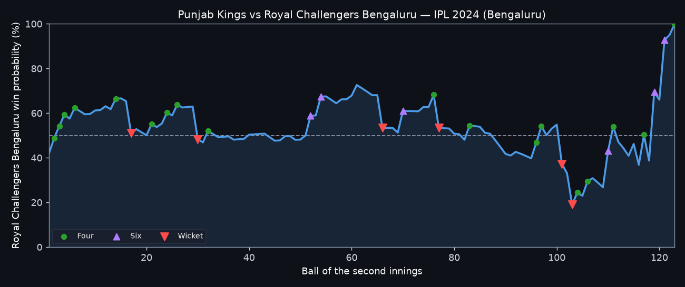
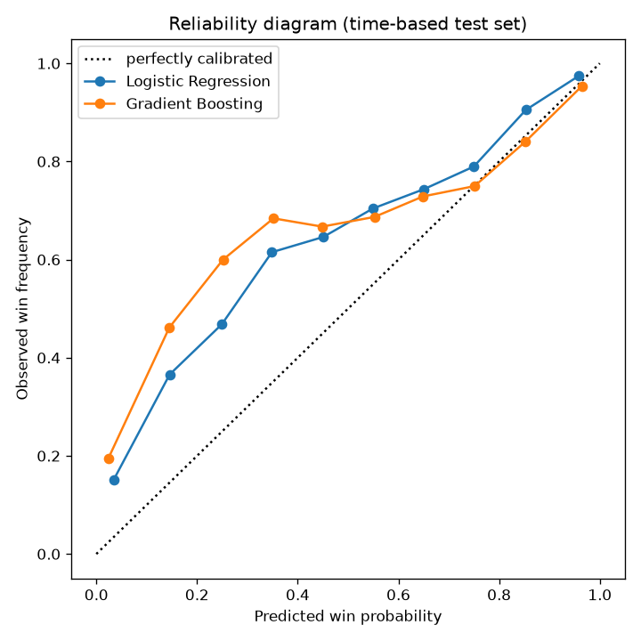

# IPL Win Probability Predictor

[](https://github.com/Pranjaltyagi76/IPL-Win-Probability-Predictor/actions/workflows/ci.yml)


Estimate the batting team's chance of winning at any point of an IPL second-innings
chase, and replay how that probability moved across a real match — ball by ball,
the way broadcast win-probability graphics do.



*Punjab Kings vs Royal Challengers Bengaluru, 2024 — the most volatile chase in
the dataset. RCB sit on a knife edge for most of the innings, collapse to 19%
after losing wickets in the 17th over, then win it. The curve crosses the 50%
line 17 times. This is the app's default view.*

---

## Contents

- [What this does](#what-this-does)
- [Quickstart](#quickstart)
- [Features](#features)
- [How it works](#how-it-works)
- [Results](#results)
- [Why the reported accuracy dropped](#why-the-reported-accuracy-dropped)
- [Deployment](#deployment)
- [Project structure](#project-structure)
- [Tests and CI](#tests-and-ci)
- [Dataset](#dataset)
- [Author](#author)

---

## What this does

Given a live match state — teams, venue, target, runs scored, balls remaining and
wickets in hand — the model returns the probability that the chasing side wins.

Two things separate this from a standard "fit a classifier, show a number" project:

1. **The evaluation is honest.** Splitting ball-by-ball rows at random leaks the
   same match into train and test and inflates the score. This project splits by
   season instead, and reports the lower, deployment-realistic number.
2. **Every prediction is explainable.** The app breaks each estimate into the
   individual factors pushing the win probability up or down.

## Quickstart

```bash
git clone https://github.com/Pranjaltyagi76/IPL-Win-Probability-Predictor.git
cd IPL-Win-Probability-Predictor
pip install -r requirements.txt
streamlit run app.py
```

The trained model (`pipe.pkl`) is not committed — it is a generated artifact.
The app trains it from the bundled data the first time it starts, so the clone
above is all you need.

Optional commands, all runnable from the repository root:

```bash
python src/train_model.py    # retrain, and print the split comparison
python src/evaluate.py       # ROC-AUC, Brier, calibration, per-phase scores
python src/build_dataset.py  # rebuild the dataset from Cricsheet
python src/make_figures.py   # regenerate the figures in this README
pytest -q                    # run the test suite
```

## Features

- **Match replay** — pick any of 1,195 historical chases and see the win-probability
  curve across the whole innings, annotated with wickets, fours and sixes.
- **Manual prediction** — enter a hypothetical match state and get an estimate.
- **Per-prediction explanations** — the top factors helping and hurting the
  batting team, as plain English plus a contribution chart.
- **Terminal-state handling** — an all-out side is shown 0%, a completed chase
  100%, instead of whatever the model happens to output.
- **Calibration reporting** — Brier score and reliability diagrams, not just
  ROC-AUC.

## How it works

### Feature engineering

`src/feature_engineering.py` merges the match and ball-by-ball tables, keeps
matches with an outright result and an unrevised target, and derives the match
state at every delivery of the second innings:

| Feature | Meaning |
| --- | --- |
| `runs_left` | Runs still required to win |
| `balls_left` | Legal deliveries remaining |
| `wickets` | Wickets in hand |
| `target` | Runs needed to win (first-innings total + 1) |
| `crr` | Current run rate |
| `rrr` | Required run rate |
| `batting_team`, `bowling_team`, `city` | Categorical context |

The label is whether the batting team went on to win.

Two details that are easy to get wrong and matter here:

- **Only legal deliveries count.** Wides and no-balls do not consume a ball, so
  `balls_left` is driven by a legal-ball flag rather than the over number. The
  naive `(over - 1) * 6 + ball` miscounts every over containing an extra.
- **Only live states are kept.** A chase with the target reached, no balls left
  or no wickets left is already decided. Those rows would teach the model to
  restate certainties, so they are excluded from training and resolved by rules
  at prediction time instead.

### Model

A scikit-learn `Pipeline`: one-hot encoding for the categorical columns, standard
scaling for the numeric ones, and logistic regression on top. The pipeline is
serialised to `pipe.pkl`, which is generated rather than committed — the app
trains it automatically on first run.

## Results

All figures below are on the season-based test set (2024–2026), produced by
`python src/evaluate.py`.

Because the output is a probability, ROC-AUC alone is not enough — it only
measures ranking. **Brier score** (mean squared error of the predicted
probability, lower is better) measures whether the numbers themselves are
trustworthy.

| Model | ROC-AUC | Brier | Brier (calibrated) |
| --- | --- | --- | --- |
| **Logistic Regression** | **0.8637** | **0.1711** | **0.1597** |
| Gradient Boosting | 0.8459 | 0.1886 | 0.1744 |

Logistic regression wins on both ranking and probability quality, so the simpler
and more interpretable model is also the better one here — that is why it ships.
Isotonic calibration improves it further (0.1711 → 0.1597).

### Where the model is weakest

| Innings phase | Brier |
| --- | --- |
| Powerplay (ov 1–6) | 0.2383 |
| Middle (ov 7–15) | 0.1548 |
| Death (ov 16–20) | 0.0958 |

The model is least reliable early and sharpest at the death, which is expected:
genuine uncertainty collapses as a chase runs out of balls.

### Calibration: the model is too pessimistic about hard chases



The reliability curve sits **above** the diagonal at the low end — when the model
says 15%, chasing teams actually won about 37% of the time. It systematically
under-rates the side batting second when the chase looks difficult.

Era drift is *not* the explanation. Chases succeeded 54.2% of the time in the
training seasons and 55.5% in the held-out ones — barely over a point apart, far
too small to account for the gap. The more likely cause is the model itself:
logistic regression is linear in these features, and the real relationship in
desperate situations is not, so it extrapolates too confidently towards zero.

Isotonic calibration corrects most of it, which is why the calibrated Brier is
the better number (0.1711 → 0.1597).

## Why the reported accuracy dropped

An earlier version of this project reported **ROC-AUC ≈ 0.887** on a random
split. That number was measured wrongly, and the section below is the
correction.

The dataset has one row per ball. Splitting those rows at random puts balls from
the *same match* on both sides of the split, and consecutive balls of a chase are
nearly identical: 42 needed off 30 with 5 wickets, then 40 off 29 with 5 wickets.
The model can effectively recognise matches it trained on, so the test score
measures memorisation as much as skill.

Running the same model and features under three different splits shows the size
of the effect:

| Split | ROC-AUC | What it measures |
| --- | --- | --- |
| Row-random (the leaky one) | 0.8966 | Balls from one match appear in train *and* test |
| Match-grouped | 0.8713 | Whole matches held out, seasons mixed |
| **Season-based (shipped)** | **0.8637** | Train 2008–2023, test 2024–2026 |

The season split is the one that matches how the model is actually used —
predicting matches that had not happened when it was trained — so that is the
number this project reports. `python src/train_model.py` prints all three.

**The 3.3-point gap is the cost of the leak.** A model chosen or tuned against
the row-random figure would have been optimised against a number that does not
exist in deployment.

That gap used to be 6.4 points, on the smaller 2008–2019 dataset. It shrank
because there is now roughly twice as much training data, and the more matches
a model sees, the less it gains from memorising any one of them.

## Deployment

The repository is ready to deploy on [Streamlit Community
Cloud](https://share.streamlit.io) with no extra configuration:

1. Sign in with GitHub and choose **New app**.
2. Select this repository, branch `main`, main file `app.py`.
3. Deploy.

`requirements.txt` is installed automatically, `.streamlit/config.toml` supplies
the theme, and the model trains itself on first boot (about a second) because
`pipe.pkl` is not committed. The bundled CSVs mean there is no external data
dependency to configure.

## Project structure

```text
IPL-Win-Probability-Predictor/
│
├── app.py                     # Streamlit app (replay + manual modes)
├── requirements.txt
│
├── data/
│   ├── matches_all.csv        # One row per match (2008-2026)
│   └── deliveries_all.csv.gz  # One row per delivery, gzipped
│
├── src/
│   ├── build_dataset.py       # Cricsheet -> the canonical dataset above
│   ├── feature_engineering.py # Canonical data -> per-ball training rows
│   ├── train_model.py         # Split comparison + trains the shipped model
│   ├── predict.py             # Inference, terminal-state guards, explanations
│   ├── replay.py              # Ball-by-ball win-probability curves
│   ├── evaluate.py            # ROC-AUC, Brier, calibration, per-phase scores
│   └── make_figures.py        # Regenerates the figures in this README
│
├── tests/                     # pytest suite
└── .github/workflows/ci.yml   # Runs the suite on every push and PR
```

## Tests and CI

A pytest suite covers dataset schema and coverage (expected columns, no missing
city, contiguous seasons, a full innings containing exactly 120 legal
deliveries), data integrity of the feature frame (valid ranges, nothing missing
or infinite), prediction validity (probabilities stay in `[0, 1]`), cricketing
sanity (win probability rises as runs needed fall and as wickets in hand
increase), and the terminal-state guards.

The coverage check exists because of a real bug: 51 matches recorded a blank
city, which silently removed 48 of them from training. The test now fails if any
season contributes less than half the median number of rows.

GitHub Actions runs the suite on every push and pull request to `main`.

## Dataset

Ball-by-ball data for **1,243 matches across the 2008–2026 seasons**, from
[Cricsheet](https://cricsheet.org/), used under the Open Data Commons
Attribution License.

`src/build_dataset.py` downloads the upstream archive and reduces it to the two
files in `data/`, resolving a few things the raw feed leaves messy:

- Season labels are inconsistent (`2007/08`, `2020/21`), so the season is taken
  from the match date.
- Wides and no-balls are flagged so they never advance the balls-bowled count.
- `retired hurt` is excluded from wickets; it is not a dismissal.
- The 51 UAE matches that record a blank city have it recovered from the venue.
- The four genuine franchise renames are collapsed (Delhi Daredevils → Delhi
  Capitals, Kings XI Punjab → Punjab Kings, Royal Challengers Bangalore →
  Bengaluru, and a Rising Pune spelling change). Terminated franchises such as
  Deccan Chargers and Gujarat Lions are deliberately kept separate.

Regenerate it at any time — including after a new season — with:

```bash
python src/build_dataset.py --force-download
```

## Author

**Pranjal Tyagi** — B.Tech CSE (AI & DS)

If this project was useful to you, consider giving it a ⭐
